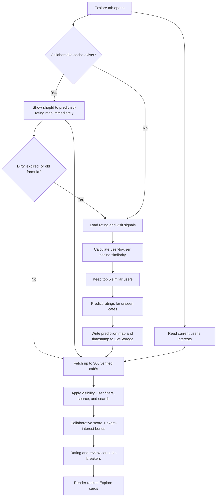

# CoFi Algorithm, Explore Feed, and Cache Guide

> Code-truth reference for the current CoFi implementation. Last checked: August 28, 2026.

For the teacher-style explanation and the current refresh story, start with
`docs/COFI_ALGORITHM_GUIDE.md`.

This document explains what CoFi means by “the algorithm,” how the Explore tab
uses it, which data affects recommendations, how the 24-hour cache works, and
where every important part is implemented.

## Quick answer

CoFi's **For You** feed is a hybrid recommender:

1. It finds up to five users with similar café-rating patterns using cosine
   similarity.
2. It predicts how much the current user may like a café from those similar
   users' ratings.
3. It adds a strong bonus for café tags that exactly match the user's selected
   interests.
4. It uses the café's public rating and review count only as tie-breakers.
5. It stores the collaborative prediction map on the device for up to 24 hours.

The final active Explore formula is:

```text
ForYouScore(café)
  = CollaborativePredictedRating(café)
  + 1.5 × ExactInterestMatchCount(café)
```

The result is sorted from highest to lowest. This score is an ordering value;
it is not displayed as the café's public star rating.

## Main source locations

| Responsibility | Location |
|---|---|
| Cosine similarity, weights, Taste Twins, predicted ratings, and 24-hour cache | `lib/features/home/explore/services/recommendation_service.dart` |
| Explore lifecycle, Firestore streams, filters, and final feed sorting | `lib/features/home/explore_tab.dart` |
| Interest-selection values and local Explore re-ranking after saving | `lib/features/auth/interest_selection_screen.dart` |
| Cross-screen recommendation refresh signal | `lib/utils/app_signals.dart` |
| Review input and refresh trigger | `lib/features/cafe/review_shop_screen.dart` |
| Visit input and refresh trigger | `lib/features/cafe/log_visit_screen.dart` |
| Rating aggregate Cloud Function | `firebase/functions/src/syncReviewAggregates.ts` |
| Firestore permissions needed by the algorithm | `firebase/firestore.rules` |
| Required compound indexes | `firebase/firestore.indexes.json` |
| Formula and signal-merging tests | `test/algorithm_test.dart` |
| GetStorage initialization and separate Firestore offline cache | `lib/main.dart` |

## End-to-end flow



## The data used by the algorithm

### 1. A user's star ratings

Reviews are stored at:

```text
shops/{shopId}/reviews/{reviewId}
```

Each relevant review provides:

```text
userId, rating (1–5), tags, createdAt
```

The review-writing flow is in
`lib/features/cafe/review_shop_screen.dart`. Firestore rules require the rating
to be from 1 through 5.

Ratings are the primary user-to-user preference signal. The algorithm compares
users only on cafés that **both users rated**.

### 2. Visit-context tags

Reviews and visit logs can contain these context tags:

| Visit context | Weight |
|---|---:|
| Study Session | 0.075 |
| Business Meeting | 0.075 |
| Chill / Hangout | 0.075 |
| Group Gathering | 0.075 |
| **Total** | **0.30** |

Visit logs are stored at:

```text
shops/{shopId}/visits/{visitId}
```

`mergeReviewAndVisitSignals()` merges the visit tags into an existing rated
café. A visit without a review is intentionally not converted into a zero-star
rating and is not currently part of the similarity vector.

That means:

- Rating + visit: used.
- Rating without a separate visit: used.
- Visit without a rating: recorded in history, but not used in cosine
  similarity.

### 3. Café amenity and preference tags

Café tags are stored in the shop document:

```text
shops/{shopId}.tags
```

The current amenity weights are:

| Amenity/tag | Weight |
|---|---:|
| Specialty Coffee | 0.06 |
| Espresso | 0.02 |
| Flat White | 0.02 |
| Spanish Latte | 0.02 |
| Vietnamese Coffee | 0.02 |
| Cold Brew | 0.02 |
| Pour Over | 0.02 |
| Matcha Drinks | 0.02 |
| Pastries | 0.10 |
| Work-Friendly (Wi-Fi + outlets) | 0.04 |
| Pet-Friendly | 0.04 |
| Parking Available | 0.04 |
| Artsy / Aesthetic | 0.02 |
| Instagrammable | 0.02 |
| Night Café (Open Late) | 0.02 |
| Family Friendly | 0.02 |
| Minimalist / Modern | 0.05 |
| Rustic / Cozy | 0.05 |
| Outdoor / Garden | 0.05 |
| Seaside / Scenic | 0.05 |
| **Total** | **0.70** |

The weight constants are defined at the top of
`recommendation_service.dart`. The visit subtotal is 0.30 and the amenity
subtotal is 0.70, matching the documented 30/70 weighting table.

### 4. The user's selected interests

Interests are stored at:

```text
users/{userId}.interests
```

They are selected and saved in
`lib/features/auth/interest_selection_screen.dart`. Explore compares these
strings with each shop's `tags`. Matching is currently exact and
case-sensitive.

Selected interests affect the final feed directly. They do not replace the
collaborative algorithm.

### 5. Café public rating and review count

The shop document's `ratings` field is the public average rating. The Cloud
Function in `firebase/functions/src/syncReviewAggregates.ts` recalculates it
after a review is created, updated, or deleted:

```text
PublicAverage = sum(valid review ratings) / valid review count
```

Only numeric ratings from 1 through 5 are included. The same function stores a
bounded preview of the latest 50 reviews in `shops/{shopId}.reviews`.

The public average rating is used to:

- select the top 30 cafés used to build user-similarity vectors;
- select the top 100 verified recommendation candidates;
- break ties in the final For You ordering;
- rank the Popular feed;
- rank the currently active Monthly Featured section.

It is not directly added to the For You score unless two cafés have the same
combined score and need a tie-breaker.

## Formula 1: user-to-user cosine similarity

Implementation: `RecommendationService.calculateCosineSimilarity()` in
`lib/features/home/explore/services/recommendation_service.dart`.

For every café `p` that both users rated:

```text
Xp = user X's star rating for café p
Yp = user Y's star rating for café p
Tp = total weight of visit-context tags both users share for café p
Ap = total weight of café p's amenity tags

X'p = Xp + Tp + Ap
Y'p = Yp + Tp + Ap
```

Then:

```text
                     Σ(X'p × Y'p)
Similarity(X,Y) = ─────────────────────
                   √Σ(X'p²) × √Σ(Y'p²)
```

The result is clamped to the range 0.0–1.0:

- `1.0`: the two vectors point in the same direction;
- close to `0.0`: no measurable agreement;
- no commonly rated cafés: exactly `0.0`.

### Worked example from the test suite

The test in `test/algorithm_test.dart` uses three common cafés:

| Café | User X rating | User Y rating | Shared visit weight | Amenity weight | X' | Y' |
|---|---:|---:|---:|---:|---:|---:|
| A | 4 | 4 | 0.075 | 0.04 | 4.115 | 4.115 |
| B | 5 | 4 | 0 | 0.09 | 5.09 | 4.09 |
| C | 3 | 5 | 0 | 0.04 | 3.04 | 5.04 |

Putting those vectors into the cosine formula produces approximately `0.957`.

### How Taste Twins are chosen

`_findSimilarUsers()` performs these steps:

1. Confirms the Firebase user is still authenticated and refreshes the ID
   token before querying.
2. Loads the 30 shops with the highest `ratings` value.
3. Loads review and visit collection groups and retains signals belonging to
   those 30 shops.
4. Builds the current user's rated vector and one vector per other user.
5. Calculates cosine similarity for every eligible user.
6. Discards similarity values of `0.1` or lower.
7. Sorts descending and keeps the top five users.

Firestore collection-group reads for reviews and visits are authorized in
`firebase/firestore.rules`. If those deployed rules do not match the repository,
Firestore can return `permission-denied`; the service logs the failed stage and
returns an empty result instead of crashing Explore.

## Formula 2: predicted rating for each café

After CoFi finds similar users, it considers up to 100 verified cafés ordered
by public rating. Cafés already bookmarked or visited by the current user are
excluded from the collaborative prediction map.

For a candidate café `s`:

```text
                           Σ(similarity(user) × user's rating for s)
PredictedRating(s) = ─────────────────────────────────────────────────
                                  Σ(similarity(user))
```

Only reviews written by one of the top similar users contribute. The result is
clamped to 0–5.

Example:

```text
Twin A: similarity 0.90, café rating 5
Twin B: similarity 0.60, café rating 3

Predicted rating = (0.90×5 + 0.60×3) / (0.90+0.60)
                 = 6.30 / 1.50
                 = 4.20
```

This produces the cached map:

```text
{
  "shopA": 4.20,
  "shopB": 3.85
}
```

## Formula 3: final For You ranking

Implementation: `_applyFilters()` in `lib/features/home/explore_tab.dart`.

Explore fetches up to 300 verified shops, removes hidden and archived shops,
applies the active filters, and then calculates:

```text
InterestBonus = exact matching shop tags × 1.5
FinalForYouScore = cached predicted rating + InterestBonus
```

Sorting priority:

1. Higher final For You score.
2. Higher public `ratings` average.
3. More entries in the embedded `reviews` preview list.

### Example

```text
Café A: predicted 4.4 + two interest matches (2×1.5) = 7.4
Café B: predicted 4.8 + one interest match  (1×1.5) = 6.3
```

Café A appears first even though Café B has the higher collaborative prediction.
The interest bonus is deliberately strong and can dominate the collaborative
score.

For cafés without a collaborative prediction, the value starts at zero. They
can still rank well through exact interest matches.

## How the 24-hour cache works

Implementation: `RecommendationService.loadRecommendationScores()`.

CoFi uses `GetStorage`, initialized in `lib/main.dart`, to persist a score map
and cache metadata scoped to the signed-in user:

```text
shop_recommendations_{userId}  -> Map<shopId, predictedRating>
shop_rec_timestamp_{userId}    -> millisecondsSinceEpoch
shop_rec_input_version_{userId}
shop_rec_calculated_version_{userId}
shop_rec_dirty_{userId}
shop_rec_algorithm_version_{userId}
shop_rec_last_attempt_{userId}
```

On load:

```text
age = now - saved timestamp

if a saved prediction map exists:
    show it immediately
    if dirty, expired, or from an old formula:
        revalidate in the background
else:
    calculate Taste Twins and predicted ratings

replace the saved map only after a successful calculation
```

Important details:

- The cache is local to that installation of the app, not stored in Firestore.
- Its physical file location is managed by `get_storage` in the platform's app
  data directory; there is no cache file inside this repository.
- Cache keys include the Firebase UID, so two accounts do not read each other's
  prediction map.
- An empty valid result is cached too. This prevents new or low-activity users
  from repeatedly running expensive reads.
- The cache contains only collaborative predicted ratings. It does **not**
  cache the visible shop list, selected interests, filters, search results,
  opening hours, public ratings, or rendered cards.
- Pull-to-refresh rereads interests and calls the normal cache-aware load. It
  does not force a full collaborative recomputation while the cache is valid.

### When the cache is reused or revalidated

| User action | Current behavior |
|---|---|
| Change interests | Keeps collaborative cache and re-sorts locally with the new interest bonus |
| Submit a review | Advances the input version, keeps old scores visible, and schedules one background revalidation |
| Log an unrated visit | Updates visit state without collaborative recalculation |
| Add visit context to an already rated café | Marks the cache dirty and schedules background revalidation |
| Pull to refresh Explore | Uses the cache; revalidates only when metadata says it is needed |
| Reopen app before 24 hours | Loads cached predicted ratings |
| Reopen app after 24 hours | Shows stale predictions first and revalidates in the background |

The `recommendationVersion` signal is reserved for rating-context inputs.
`interestsVersion` independently asks Explore to fetch interests and re-sort
without running cosine similarity. Both live in `lib/utils/app_signals.dart`.

### Do users need to reload after changing interests?

No. Saving interests currently does all of the following:

1. Writes the new list to `users/{uid}.interests`.
2. Increments `interestsVersion`.
3. The mounted Explore screen rereads interests.
4. The exact-interest bonus changes immediately.
5. The existing collaborative score map remains cached.

This behavior is implemented in
`lib/features/auth/interest_selection_screen.dart` and
`lib/features/home/explore_tab.dart`.

## The 24-hour cache is not the Firestore offline cache

CoFi also enables Firestore persistence with a 100 MB limit in `lib/main.dart`:

```dart
FirebaseFirestore.instance.settings = const Settings(
  persistenceEnabled: true,
  cacheSizeBytes: 100 * 1024 * 1024,
);
```

These caches solve different problems:

| Cache | Purpose | Lifetime/rule |
|---|---|---|
| GetStorage recommendation cache | Avoid recalculating Taste Twins and predicted café ratings | Explicit 24-hour timestamp |
| Firestore offline cache | Reuse Firestore documents and support offline reads | Managed automatically by Firebase, up to 100 MB |
| Image cache | Reuse downloaded café images | Managed by `cached_network_image` |

## How each Explore tab mode is ordered

### For You

- Firestore candidate query: verified shops, newest first, limit 300.
- Local ranking: collaborative prediction + exact-interest bonus.
- Tie-breakers: public rating, then embedded review-preview count.
- Rank numbers are displayed only when there is no search query or manual tag
  filter.

### Popular

- Verified shops, ordered by `ratings` descending, limit 300.
- Local tie-breaker: embedded review-preview count descending.

### Newest

- Verified shops, ordered by `postedAt` descending, limit 300.

### Open now

- Fetches verified shops newest first, limit 300.
- Locally checks today's schedule and current device time.
- Supports overnight schedules: when closing time is earlier than or equal to
  opening time, the interval crosses midnight.
- Remaining shops are ordered by `postedAt` descending. Distance is not part of
  this Explore ordering.

### Search and filters

- Search checks café name and address.
- Starting a search while For You is active switches the chip to Popular.
- Manual tag filters use **OR** behavior: a café stays if any selected filter
  matches one of its tags.
- Favorites use `users/{uid}.bookmarks`.
- Visited uses `users/{uid}.visited`.
- Source filtering classifies a shop as business-created when
  `submissionType == "business"` or it has a non-empty `ownerId`.
- Hidden and archived shops are always removed locally.

## Monthly Featured is currently separate

The visible Monthly Featured carousel queries:

```text
shops where isFeatured == true, limit 5
```

It currently calls `_sortFeaturedShops()`, which sorts by:

1. Public rating descending.
2. Embedded review-preview count descending.

`_sortFeaturedShopsWithAlgorithm()` exists in `explore_tab.dart`, but the
visible carousel does not currently call it. Therefore the Monthly Featured
carousel is **not personalized** in the active UI, despite the older method and
comments still existing in the file.

## Recommendation notifications are a different algorithm

The notification recommender in `lib/services/notification_service.dart` does
not sort the Explore feed.

It first queries up to ten verified shops matching one of the first ten user
interests, then calculates:

```text
NotificationScore
  = (publicRating / 5)
  × (1 + clamp(reviewCount / 100, 0, 1))
```

- Score `<= 0.5`: no recommendation notification.
- Score `> 0.5` and `< 0.7`: standard recommendation.
- Score `>= 0.7`: high-priority sound-enabled match, subject to the user's
  notification preferences and OS permission.
- Generation is scheduled at a randomized interval from 12 to 48 hours.

This notification score has a theoretical range of 0–2, so it should not be
read as a literal percentage without normalization.

## Current implementation notes and known gaps

These notes describe the code as it exists; they are important when comparing
the implementation with the paper.

1. **The 30/70 weights are added to raw 1–5 ratings.** The weight maps total
   0.30 and 0.70, but the rating itself is not normalized to 0–1 before
   addition. Therefore the final composite is rating-dominant; the weights do
   not represent 30% and 70% of the entire `rating + visit + amenity` value.
2. **Amenity weight is identical on both user vectors for the same café.** This
   can raise similarity even though the amenity is a café property rather than
   an independently expressed preference from each user.
3. **Unknown tags have very large fallbacks.** An unknown shared visit tag uses
   `0.5`, and an unknown café amenity uses `0.3`. Both are much larger than the
   documented individual weights. Stored tags should use the canonical strings
   in the tables above.
4. **`Study Session` and `Study Sessions` are different strings.** Visit context
   uses the singular form; interest/shop tags use the plural form. This is
   intentional in the current UI but must not be mixed when calculating exact
   matches.
5. **Standalone visits do not affect Taste Twin similarity.** They update visit
   history and can trigger recomputation, but signal merging keeps only cafés
   with a rating.
6. **`ratingCount` is not updated by the current aggregate Cloud Function.** The
   function updates `ratings` and the `reviews` preview, while the notification
   algorithm reads `ratingCount`. Unless another deployed backend process
   maintains it, the notification confidence multiplier may remain at its
   default count of zero.
7. **The embedded review list is capped at 50.** Explore uses its length as a
   tie-breaker, so it is a bounded preview count, not necessarily the lifetime
   review total.
8. **Refresh intent is persisted as cache metadata.** Rating-context changes
   advance an input version and set `dirty`, so Explore can revalidate after it
   mounts again. Interest changes use a separate signal and never delete the
   collaborative cache.
9. **The current similarity pass reads collection-group review and visit data.**
   It filters the results to the top 30 shops in the app, which is simpler than
   one read per shop but can still become expensive as CoFi grows.

## Safe rules for future algorithm changes

When changing this system:

1. Update the formula in `RecommendationService`, not only comments in
   `ExploreTab`.
2. Keep tag strings identical across interest selection, shop submission,
   reviews, visits, filters, and weight maps.
3. Update or add cases in `test/algorithm_test.dart` before changing weights.
4. Bump or invalidate cached results when a formula or weight changes; an old
   cache otherwise remains valid for up to 24 hours.
5. Deploy matching Firestore rules and indexes before testing on a device.
6. Verify cold-start users, users with no common cafés, and permission failures.
7. Keep public star ratings separate from internal ranking scores in the UI.
8. If the implementation must exactly represent the research paper's percentage
   contributions, normalize all components to a common scale and document the
   migration before changing production behavior.

## One-sentence explanation for a presentation

> CoFi uses a hybrid recommendation system: cosine similarity finds users with
> comparable café ratings and visit context, their ratings predict unseen cafés,
> and exact matches with the current user's interests personalize the final
> Explore ranking, while the expensive collaborative result is cached locally
> for 24 hours.
