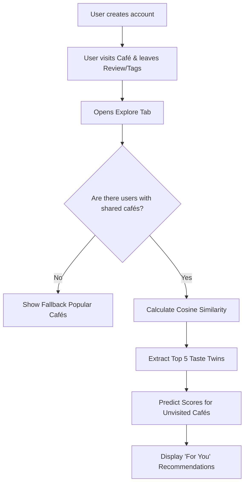
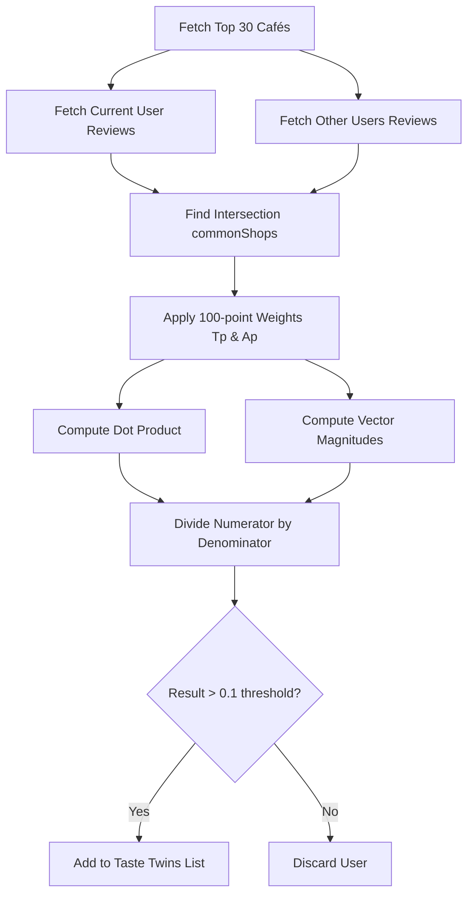

# CoFi Recommendation Engine

This document provides a comprehensive, authoritative breakdown of the CoFi Recommendation Engine as implemented in the application source code. It is designed to serve as a technical reference for developers, researchers, and thesis defense panelists.

---

## 1. Recommendation Engine Overview

The CoFi Recommendation Engine uses a **Collaborative Filtering** algorithm powered by **Cosine Similarity**. 

Instead of randomly suggesting cafés or strictly filtering by static tags, the system intelligently identifies "Taste Twins"—other users in the database whose café preferences strongly align with yours. 

> [!NOTE]
> The engine works by mathematically comparing how you and other users have interacted with the exact same cafés.

It considers:
1. **User Ratings:** The 1-5 star ratings given to cafés.
2. **Visit Tags:** The purpose of the visit (e.g., "Study Session", "Business Meeting").
3. **Café Amenities:** The features of the cafés both users visited (e.g., "Specialty Coffee", "Wi-Fi").

By mapping these factors into a mathematical vector, the engine calculates the Cosine Similarity between users. Once similar users are found, the engine aggregates their highest-rated cafés (that you haven't visited yet) and recommends them to you, predicting how much you will like them based on the mathematical similarity of your profiles.

---

## 2. Complete User Flow

The actual step-by-step recommendation pipeline, as confirmed by the implementation, follows these steps:

1. **Registration & Profile Creation:** The user creates an account and can specify general interests.
2. **Café Interactions:** The user visits a café and logs a visit or submits a review.
3. **Data Collection:** The system stores the user's 1-5 star rating and specific tags regarding their visit context.
4. **Candidate Matching:** When the Explore tab is opened, the algorithm fetches up to the top 30 most-rated cafés and gathers all reviews/visits for the current user and all other users.
5. **Intersection Filter:** The system strictly isolates cafés that **both** the current user and the compared user have reviewed or visited.
6. **Vector Construction:** For every common café, the algorithm constructs a numerical value combining the Rating, matching Visit Tags, and the café's Amenity Tags.
7. **Similarity Calculation:** The engine runs the Cosine Similarity formula to calculate a score between `0.0` and `1.0`.
8. **Thresholding & Taste Twins:** Users with a similarity score `> 0.1` (10%) are identified as "Taste Twins". The top 5 most similar users are kept.
9. **Recommendation Prediction:** The engine looks at other cafés these Taste Twins have rated highly and calculates a predicted rating score.
10. **Delivery:** The cafés are ranked by this predicted score and displayed in the "For You" feed.

> [!IMPORTANT]
> The algorithm requires at least one shared café interaction between two users to evaluate them mathematically. If there are no common cafés, they cannot be compared.

---

## 3. Preference Weighting

The system implements the strict 100-point (percentage-point) preference weighting system. These values dynamically augment the mathematical vectors during the Cosine Similarity calculation.

**Formula:** `Effective Weight = Category Percentage × Internal Percentage / 100`

### Verified Weight Allocation

| Category | Category Total | Specific Tag | Effective Weight (pp) | Code Value |
| :--- | :--- | :--- | :--- | :--- |
| **Visit Data** | **30%** | Study Session | 7.5 | `0.075` |
| | | Business Meeting | 7.5 | `0.075` |
| | | Chill / Hangout | 7.5 | `0.075` |
| | | Group Gathering | 7.5 | `0.075` |
| **Type of Drinks** | **20%** | Specialty Coffee | 6.0 | `0.060` |
| | | Espresso | 2.0 | `0.020` |
| | | Flat White | 2.0 | `0.020` |
| | | Spanish Latte | 2.0 | `0.020` |
| | | Vietnamese Coffee | 2.0 | `0.020` |
| | | Cold Brew | 2.0 | `0.020` |
| | | Pour Over | 2.0 | `0.020` |
| | | Matcha Drinks | 2.0 | `0.020` |
| **Pastries** | **10%** | Pastries | 10.0 | `0.100` |
| **Convenience** | **20%** | Work-Friendly (Wi-Fi + outlets) | 4.0 | `0.040` |
| | | Pet-Friendly | 4.0 | `0.040` |
| | | Parking Available | 4.0 | `0.040` |
| | | Artsy / Aesthetic | 2.0 | `0.020` |
| | | Instagrammable | 2.0 | `0.020` |
| | | Night Café (Open Late) | 2.0 | `0.020` |
| | | Family Friendly | 2.0 | `0.020` |
| **Vibe** | **20%** | Minimalist / Modern | 5.0 | `0.050` |
| | | Rustic / Cozy | 5.0 | `0.050` |
| | | Outdoor / Garden | 5.0 | `0.050` |
| | | Seaside / Scenic | 5.0 | `0.050` |
| **GRAND TOTAL** | **100%** | | **100.0** | |

> [!TIP]
> **Implementation Details**
> - **Matching Allocation:** Unselected preferences strictly receive zero.
> - **Aliases:** The alias `'Study Sessions'` was intentionally omitted to prevent double-counting with `'Study Session'`.
> - **Unknown Tags:** Unknown visit tags default to `0.5`, and unknown amenity tags default to `0.3` to ensure the algorithm doesn't crash on legacy data.

> [!CAUTION]
> The examples showing User 1 = 54%, User 2 = 94%, User 3 = 48% represent the theoretical summation of user-profile preferences. In the code, these percentage values map directly into the $T_p$ and $A_p$ vector augmentations (Section 4), rather than overriding the final mathematically computed Cosine Similarity percentage.

---

## 4. Cosine Similarity Algorithm

The code implements a customized version of Cosine Similarity that blends explicit feedback (ratings) with implicit feedback (visit tags and café amenities).

### The Formula
$$ \text{Similarity} = \frac{\sum_{i=1}^{n} (X_p + T_p + A_p)_i \times (Y_p + T_p + A_p)_i}{\sqrt{\sum_{i=1}^{n} (X_p + T_p + A_p)_i^2} \times \sqrt{\sum_{i=1}^{n} (Y_p + T_p + A_p)_i^2}} $$

### Variables Explained
- **$n$**: The set of *Common Cafés* that both User X and User Y have reviewed or visited.
- **$X_p$**: User X's rating for the café (0.0 to 5.0).
- **$Y_p$**: User Y's rating for the café (0.0 to 5.0).
- **$T_p$**: The sum of predefined percentage weights for every visit tag that *both* users selected for this specific café.
- **$A_p$**: The sum of predefined percentage weights for the specific café's built-in amenities.

---

## 5. Worked Calculation Example

````carousel
### Step 1: The Scenario
Let's manually calculate a scenario using the exact logic in the code.

**Scenario:** 
User A and User B both visited exactly two common cafés: **Café 1** and **Café 2**.
<!-- slide -->
### Step 2: Café 1 Calculations
- Amenities: Specialty Coffee (`0.06`), Wi-Fi (`0.04`) → $A_{p1} = 0.10$
- Visit Tags matched between users: Study Session (`0.075`) → $T_{p1} = 0.075$
- User A Rating ($X_{p1}$): `5.0`
- User B Rating ($Y_{p1}$): `4.0`

**Calculated Scores:**
- User A Score 1: $5.0 + 0.075 + 0.10 = 5.175$
- User B Score 1: $4.0 + 0.075 + 0.10 = 4.175$
<!-- slide -->
### Step 3: Café 2 Calculations
- Amenities: Pastries (`0.10`) → $A_{p2} = 0.10$
- Visit Tags matched between users: None → $T_{p2} = 0.0$
- User A Rating ($X_{p2}$): `3.0`
- User B Rating ($Y_{p2}$): `5.0`

**Calculated Scores:**
- User A Score 2: $3.0 + 0.0 + 0.10 = 3.10$
- User B Score 2: $5.0 + 0.0 + 0.10 = 5.10$
<!-- slide -->
### Step 4: The Math
**Dot Product (Numerator):** 
$(5.175 \times 4.175) + (3.10 \times 5.10) = 21.605 + 15.81 = \mathbf{37.415}$

**User A Magnitude Squared:**
$(5.175^2 + 3.10^2) = 26.78 + 9.61 = 36.39$

**User B Magnitude Squared:**
$(4.175^2 + 5.10^2) = 17.43 + 26.01 = 43.44$

**Denominator:**
$\sqrt{36.39} \times \sqrt{43.44} = 6.032 \times 6.590 = \mathbf{39.75}$
<!-- slide -->
### Step 5: Final Result
$37.415 \div 39.75 = \mathbf{0.9412}$

> [!NOTE]
> **94.12% Similarity**

Because `0.9412 > 0.1`, User B is successfully added as a Taste Twin for User A!
````

---

## 6. Diagrams

### User Journey Flow


### Internal Engine Calculation Flow


---

## 7. Code Traceability

| Engine Stage | File Path | Class / Function | Input | Output |
| :--- | :--- | :--- | :--- | :--- |
| Find Common Cafés | [explore_tab.dart](file:///Users/kylechristiancabanig/flutter/CoFi/lib/features/home/explore_tab.dart) | `calculateCosineSimilarity` | User 1 & 2 Review Lists | Common Shop IDs Set |
| Preference Weighting | [explore_tab.dart](file:///Users/kylechristiancabanig/flutter/CoFi/lib/features/home/explore_tab.dart) | `defaultVisitTagWeights` & `defaultAmenityTagWeights` | Tag Strings | Percentage `double` |
| Cosine Similarity | [explore_tab.dart](file:///Users/kylechristiancabanig/flutter/CoFi/lib/features/home/explore_tab.dart) | `calculateCosineSimilarity` | Vectors, Weights | `double` (0.0 - 1.0) |
| Match Similar Users | [explore_tab.dart](file:///Users/kylechristiancabanig/flutter/CoFi/lib/features/home/explore_tab.dart) | `_findSimilarUsers` | Firestore Data | `List<Map>` (Top 5 Twins) |
| Rank & Predict | [explore_tab.dart](file:///Users/kylechristiancabanig/flutter/CoFi/lib/features/home/explore_tab.dart) | `_loadRecommendationScores` | Similar Users | `Map<String, double>` (Scores) |
| Review Submission | [write_review_screen.dart](file:///Users/kylechristiancabanig/flutter/CoFi/lib/features/cafe/write_review_screen.dart)| `WriteReviewScreen` | UI Forms | Firestore Document |

---

## 8. Edge Cases and Limitations

> [!WARNING]
> **Cold Start Problem**
> New users with no reviews or logged visits will have `0` common cafés with everyone. The algorithm cannot perform collaborative filtering for them and will silently fall back to general popular cafés.

> [!WARNING]
> **Empty Intersections**
> Two active users who have both reviewed 50 cafés, but have absolutely zero overlapping cafés, will yield a `0.0` similarity.

> [!WARNING]
> **Query Limits**
> To preserve Firestore reads and API speed, the system currently only scans the top 30 most-rated cafés when building user vectors (`limit(30)` in `_findSimilarUsers()`). Users who only visit highly obscure, unrated cafés may not be matched successfully.

> [!WARNING]
> **Stale Cache**
> Recommendations are cached locally for 24 hours (`_recTimeKey`). If a user submits a review, the "For You" list will not instantly adapt unless the user manually forces a pull-to-refresh.
