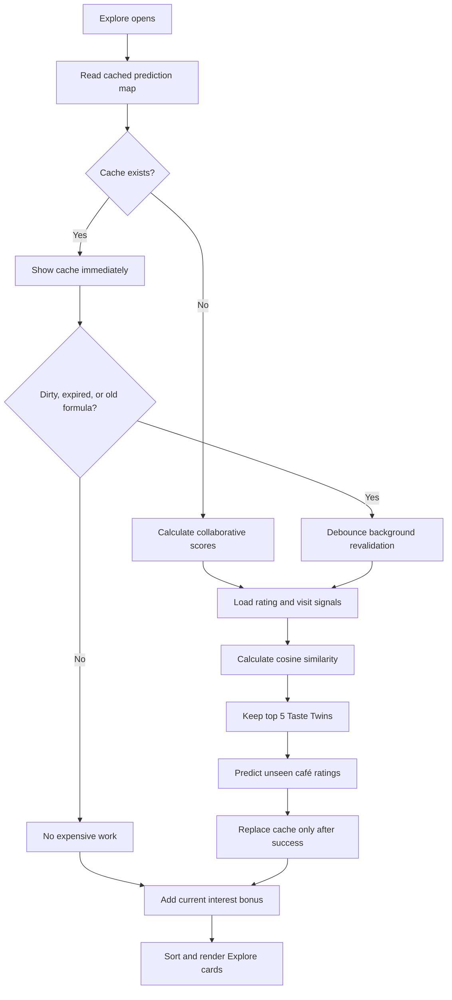

# CoFi Recommendation Algorithm: A Teacher's Story and Code Guide

> Current implementation guide. Last verified: August 28, 2026.

## First, imagine how a teacher would explain CoFi

Imagine that Ana has just joined CoFi. She says she likes quiet cafés, specialty
coffee, and places with Wi-Fi, but the app still does not know how she actually
rates cafés. Her selected interests are useful clues, but they are not yet proof
of her taste. CoFi therefore begins with a practical fallback: show cafés that
match her interests and use public ratings and review activity to break ties.

After Ana reviews cafés, CoFi learns something stronger. Suppose she gives one
café five stars and another café two stars. Ben has reviewed some of the same
cafés. If Ben's pattern is similar—high ratings where Ana rates highly and low
ratings where Ana rates poorly—CoFi treats Ben as a possible “Taste Twin.” It
does the same comparison with other users and keeps the strongest matches.

The comparison uses **cosine similarity**. You can picture every user's café
ratings as an arrow. Two arrows pointing in nearly the same direction represent
similar rating patterns and produce a score near `1`. Very different patterns
produce a score closer to `0`. CoFi compares users only through cafés they have
both rated, because without a shared café there is no fair point of comparison.

The star rating is the main value in each shared café comparison. Matching visit
tags add context: two people who both describe a café as a study destination
have more evidence in common. Café amenities also add the paper's contextual
weights. These additions do not replace the rating; they refine it.

Once CoFi finds up to five similar users, it looks at cafés those users rated
that Ana has not already bookmarked or visited. A Taste Twin with stronger
similarity contributes more to the prediction. For example, a rating from a
user with similarity `0.90` matters more than a rating from a user with
similarity `0.30`. The result is a predicted rating for each unseen café.

Finally, Explore adds Ana's current interests. This is deliberately a separate,
lightweight step. If a café has tags matching two of Ana's interests, it gets
two interest bonuses. This means interest edits can reshape Explore immediately
without repeating the expensive search for Taste Twins.

The algorithm therefore has two layers:

1. A comparatively expensive collaborative prediction based on ratings,
   similar users, visit context, and amenities.
2. A cheap local ranking layer that adds current interest matches and applies
   public-rating tie-breakers.

The 24-hour cache is like keeping yesterday's solved worksheet. CoFi can reuse
the collaborative answers while nothing meaningful has changed. If Ana submits
a new rating, the app does not throw that worksheet away and show a blank page.
It keeps displaying the previous results, marks them as outdated, and prepares
one replacement calculation in the background. This pattern is called
**stale-while-revalidate**.

If Ana reviews several cafés close together, each review advances an input
version. The short debounce combines rapid signals, and only one calculation is
allowed to run at a time. If another rating arrives during that calculation,
CoFi queues one follow-up so the final cache includes the newest version.

Reviews and business replies follow a different path. They are conversation
data, so Firestore streams update them while the relevant screen is open. A
business reply does not change Ana's rating vector and must not run cosine
similarity. This is why a reply can appear without a manual reload while the
recommendation cache remains untouched.

## The formulas

### 1. User-to-user similarity

For every café `p` that both users rated:

```text
UserOneValue(p) = Xp + Tp + Ap
UserTwoValue(p) = Yp + Tp + Ap

Similarity =
  Σ(UserOneValue × UserTwoValue)
  ─────────────────────────────────────────────────────
  √Σ(UserOneValue²) × √Σ(UserTwoValue²)
```

Where:

- `Xp` is the first user's 1–5 star rating.
- `Yp` is the second user's 1–5 star rating.
- `Tp` is the sum of visit-tag weights shared by both users.
- `Ap` is the sum of the café's amenity weights.

The result is clamped between `0` and `1`. CoFi keeps candidates above `0.1`,
sorts them from most similar to least similar, and takes the top five.

### 2. Predicted café rating

```text
PredictedRating(café) =
  Σ(TasteTwinSimilarity × TasteTwinRating)
  ─────────────────────────────────────────
  Σ(TasteTwinSimilarity)
```

The predicted value is clamped to the public star-rating scale of `0–5`.

### 3. Final For You ordering

```text
InterestBonus(café) = ExactInterestMatchCount × 1.5

ForYouScore(café) = PredictedRating(café) + InterestBonus(café)
```

If two cafés have the same `ForYouScore`, Explore prefers the café with the
higher public rating, then the one with more embedded review previews.

The `ForYouScore` is an internal ordering value. It is not shown to users as a
public star rating.

## What data enters the algorithm

| Data | Firestore location | Role |
|---|---|---|
| Star rating | `shops/{shopId}/reviews/{reviewId}.rating` | Primary collaborative signal |
| Review visit tags | `shops/{shopId}/reviews/{reviewId}.tags` | Context for rated cafés |
| Logged visit tags | `shops/{shopId}/visits/{visitId}.tags` | Merged only when the same café also has a rating |
| Café amenities | `shops/{shopId}.tags` | Contextual amenity weight |
| User interests | `users/{uid}.interests` | Local Explore bonus, outside cached prediction |
| Bookmarked/visited IDs | `users/{uid}` | Prevents recommending already-known cafés |
| Public rating/review count | Café document | Tie-breakers and fallback ranking |

An unrated standalone visit does not become a fake zero-star review. It updates
visit history immediately, but does not affect cosine similarity until there is
a genuine rating for that café.

## Where the code is located

| Responsibility | File |
|---|---|
| Weights, signal merging, cosine similarity, Taste Twins, prediction, cache policy | `lib/features/home/explore/services/recommendation_service.dart` |
| Explore startup, debouncing, one-at-a-time refresh, filters, and final sorting | `lib/features/home/explore_tab.dart` |
| Cross-screen recommendation and interest signals | `lib/utils/app_signals.dart` |
| Review submission and recommendation-input version update | `lib/features/cafe/review_shop_screen.dart` |
| Visit submission and rated-visit eligibility check | `lib/features/cafe/log_visit_screen.dart` |
| Interest saving and interest-only Explore refresh | `lib/features/auth/interest_selection_screen.dart` |
| Business Guest Feedback real-time review/reply stream | `lib/features/cafe/reviews_screen.dart` |
| Customer café-detail real-time recent-review/reply stream | `lib/features/cafe/cafe_details_screen.dart` |
| Business response write/edit/delete flow | `lib/features/business/response_review_bottom_sheet.dart` and `lib/features/cafe/reviews_screen.dart` |
| Review aggregate backend | `firebase/functions/src/syncReviewAggregates.ts` |
| Collection-group read permissions | `firebase/firestore.rules` |
| Algorithm and cache-policy tests | `test/algorithm_test.dart` |

## How a calculation moves through the code



`ExploreTab.initState()` first requests recommendation scores. A fresh,
compatible cache returns immediately. A stale cache also returns immediately,
but `RecommendationService.shouldRevalidate()` tells Explore to schedule a
background replacement. If no cache exists, the initial calculation runs while
the normal café stream can still provide fallback cards.

`RecommendationService._findSimilarUsers()` reads the ranked café set, review
signals, visit signals, and relevant amenities. It builds the current user's
vector and other-user vectors, calculates similarity, keeps the top five, and
loads those users' display names for diagnostics.

`RecommendationService.loadRecommendationScores()` then reads candidate café
ratings from those Taste Twins. It creates a map shaped like:

```text
{
  "shopA": 4.20,
  "shopB": 3.85
}
```

Explore stores this map in `_shopRecommendationScores`. During `_applyFilters`,
it retrieves each café's collaborative value, counts exact matches between the
café tags and `_userInterests`, adds `1.5` per match, and sorts the cards.

## The 24-hour cache

The recommendation cache is stored locally with `GetStorage` and is scoped by
Firebase UID. It is not a Firestore collection and is not shared across devices.

The cache records:

```text
shop_recommendations_{uid}         predicted-rating map
shop_rec_timestamp_{uid}           successful generation time
shop_rec_input_version_{uid}       latest rating-context input version
shop_rec_calculated_version_{uid}  version used by the last success
shop_rec_dirty_{uid}               whether newer input exists
shop_rec_algorithm_version_{uid}   formula/cache compatibility version
shop_rec_last_attempt_{uid}        most recent calculation attempt
```

A cache needs revalidation when it is missing, at least 24 hours old, marked
dirty, or produced by an older algorithm version. Dirty or expired results can
still be shown while replacement scores are calculated.

On success, CoFi stores the new scores and timestamp. It clears `dirty` only if
the input version has not changed during the calculation. On failure, CoFi
keeps the old scores and leaves the cache eligible for a later retry.

## Exact behavior for common actions

| Action | Immediate behavior | Collaborative calculation |
|---|---|---|
| Open Explore with unchanged cache under 24 hours | Show cache | None |
| Scroll, rebuild, filter, or switch tabs | Local UI work | None |
| Pull to refresh with unchanged inputs | Refresh lightweight data and reuse cache | None |
| Change interests | Fetch interests and re-sort locally | None |
| Submit a star-rated review | Publish review, mark visited, keep old feed visible | Debounced background calculation |
| Submit several rapid reviews | Save every review and advance input versions | Coalesced; never parallel |
| Log an unrated visit | Update visit state | None |
| Add visit context to a rated café | Update visit state | Debounced background calculation |
| Business replies to a review | Stream reply into visible review document | None |
| Another user posts a review | Stream review and public aggregates where observed | No global invalidation of every user's cache |
| Cache reaches 24 hours | Keep stale results visible | Background revalidation |

## Why reviews and replies do not need reload

`ReviewsScreen` listens to the selected café's `reviews` subcollection. The
café-detail screen also listens to its recent reviews. Responses are stored in
the review document's `responses` field, so adding, editing, or deleting a
response modifies a document those screens already observe. Firestore emits the
new snapshot and Flutter rebuilds the affected cards.

These listeners exist only while their widgets are mounted. When a user leaves
the screen, Flutter disposes the stream subscription. Reopening the screen
creates a listener that first receives the current stored data.

## Documentation compliance versus engineering decisions

The project paper requires explicit ratings as the main input, cosine
similarity for collaborative filtering, contextual visit/amenity weights, and a
dynamic Explore experience where recorded activity is reflected promptly. The
implemented formula preserves those requirements.

The paper does not prescribe a 24-hour duration, input-version keys, a two-second
debounce, or stale-while-revalidate. Those are engineering decisions used to
meet the paper's visible behavior without running the expensive algorithm on
every screen rebuild or pull gesture.

## Current limitation and future scaling work

The current collaborative pass still uses collection-group reads for reviews
and visits and filters them locally. This is much safer now because passive UI
actions do not trigger recalculation, but the query cost will still grow with
the database. The next scaling step should materialize per-user rating vectors
or server-generated recommendation inputs so a client does not need to scan
global signal collections.

Any future formula change must increment
`RecommendationService.recommendationAlgorithmVersion`, update the tests, and
update this guide. Otherwise an old locally cached score map could be treated as
compatible with a new formula.

## One-paragraph presentation answer

CoFi uses a hybrid recommendation algorithm. It compares users who rated the
same cafés through cosine similarity, keeping star ratings as the primary
signal and using visit tags and amenities as contextual weights. Ratings from
the five strongest Taste Twins predict how much the current user may like
unseen cafés. Explore then adds a lightweight bonus for exact interest matches
and uses public ratings as tie-breakers. Collaborative predictions are cached
locally for up to 24 hours; meaningful rating changes mark them outdated and
cause one controlled background replacement, while interests, live reviews,
and business replies update without requiring a manual reload.
