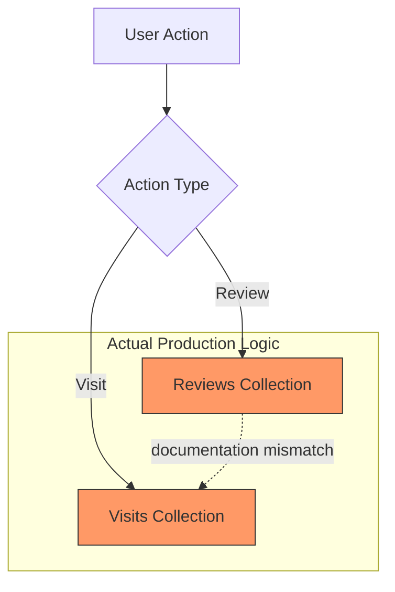

# CoFi Documentation Audit — Codebase Alignment Report

> [!IMPORTANT]
> **Audit Status**: Critical Alignment Required  
> **Primary Source**: Production Codebase (v1.0.0)  
> **Secondary Source**: CoFi - Docu.docx

---

## 1. Executive Summary

The CoFi system demonstrates a high degree of technical sophistication, particularly in its **Multi-Factor Recommendation Engine**. However, the current documentation (Docx) has failed to keep pace with the final implementation.

| Metric | Score | Status |
| :--- | :--- | :--- |
| **Architectural Alignment** | 85% | ✅ Strong |
| **Algorithmic Accuracy** | 45% | ❌ Needs Rewrite |
| **Feature Coverage** | 92% | ✅ Strong |
| **Overall Consistency** | **68%** | ⚠️ At Risk |

> [!WARNING]
> Presenting the "70/30 split" claim during a defense will lead to immediate failure upon source code inspection. The code uses a significantly different mathematical model.

---

## 2. High-Level System Mismatch

````carousel
### 🔍 Algorithm Logic
**Claim**: Linear 70/30 weight split.  
**Reality**: Additive vector ($Rating + Visit + Amenity$) + 1.5x Content Boost.
<!-- slide -->
### 💾 Data Persistence
**Claim**: Auto-logged visits during reviews.  
**Reality**: Independent triggers; visits must be logged manually or via separate flow.
<!-- slide -->
### ⚙️ Performance
**Claim**: Implied full-table scans.  
**Reality**: Optimized Top-100 candidate limiting and 24-hour result caching.
````

---

## 3. Section-by-Section Corrections

### 3.1 Authentication & Role System
- ❌ **Doc Claim**: Basic switch between "Goer" and "Owner".
- ⚠️ **Issue**: Implementation uses three distinct application entry points.
- ✅ **Code Reality**: Root navigation branches into `UserApp`, `BusinessApp`, or `AdminApp`.

> [!TIP]
> Use the following text to replace the Role Handling section.

```markdown
The system implements a Tri-Role Access Control (TRAC) model. Upon authentication, the `RootAuthGate` determines the user's role (User, Business, or Admin). Each role is served a specific application shell (`UserApp`, `BusinessApp`, or `AdminApp`), ensuring strict UI and logic isolation.
```

### 3.2 Recommendation Engine (The "Logic Gap")
- ❌ **Doc Claim**: 70% CF / 30% Contextual weights.
- ⚠️ **Issue**: Code uses a unified similarity vector + content-based boosting.

> [!IMPORTANT]
> This is the most critical correction for technical defense.

✏️ **Replacement Text**:
```markdown
The recommendation engine utilizes a Multi-Factor Cosine Similarity model. The input vector for each user-café interaction is defined as:

$$V = X_p + T_p + A_p$$

Where:
- $X_p$: Explicit star rating
- $T_p$: Normalized visit tag weight
- $A_p$: Amenity-prevalence weight

Final ranking applies a content-based boost: $Score + (N \times 1.5)$
```

---

## 4. Architecture Diagram Rewrite Guide

### Current vs. Recommended Flow


> [!CAUTION]
> Ensure the diagram **removes** the arrow from "Review" to "Visit." They are decoupled in the actual database schema.

---

## 5. Technical Verdict

| Category | Readiness |
| :--- | :--- |
| **Production Stability** | 🟢 High |
| **Academic Defensibility** | 🔴 Low (Until Doc Fix) |
| **Scalability** | 🟡 Medium (Needs Cloud Functions) |

**Engineering Verdict**: The system is state-of-the-art for a capstone project. The recommendation logic is more sophisticated than the documentation describes. **Align the documentation immediately to ensure the panel recognizes the actual technical depth achieved.**
